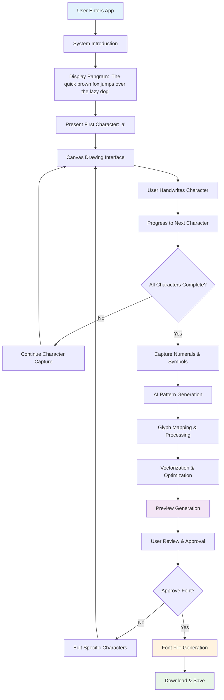
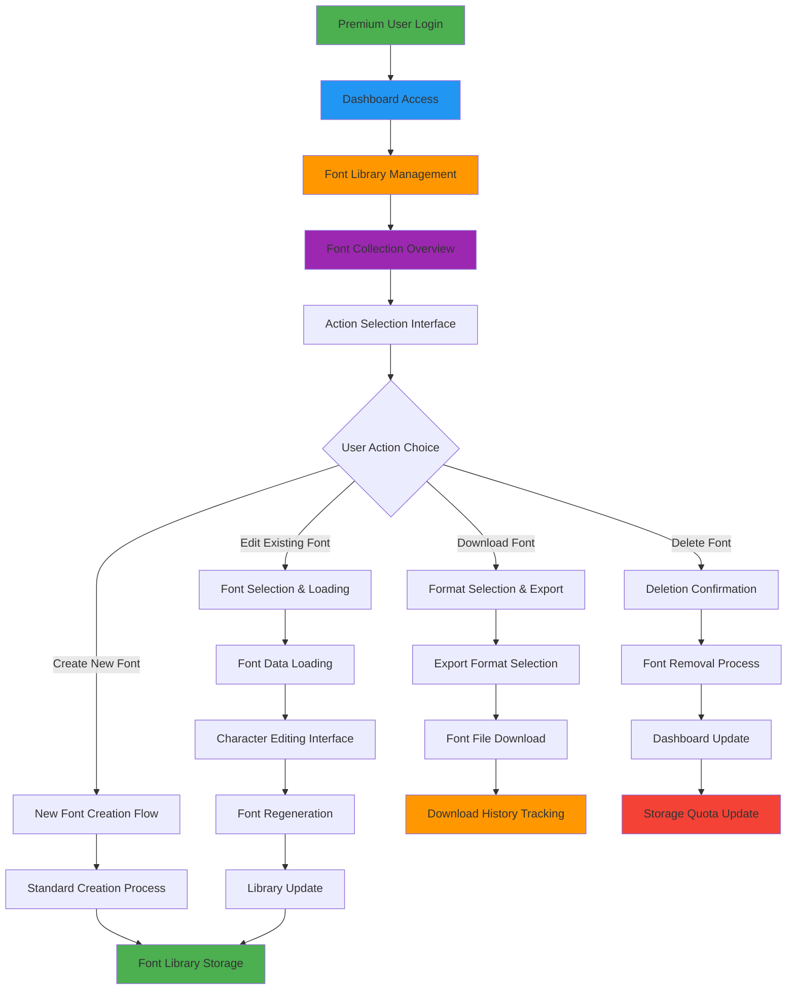

# Product Requirements Document (PRD)
## HandFont – AI-Powered Handwritten Font Generator

**Document Version:** 1.3
**Last Updated:** August 2025  
**Document Owner:** Ahsan Ali  
**Stakeholders:** Development Team, Design Team, Product Management  

---

## Table of Contents
1. [Executive Summary](#1-executive-summary)
2. [Product Overview](#2-product-overview)
3. [Target Users](#3-target-users)
4. [User Experience Flows](#4-user-experience-flows)
5. [Product Features](#5-product-features)
6. [Technical Specifications](#6-technical-specifications)
7. [Business Model](#7-business-model)
8. [Success Criteria](#8-success-criteria)

---

## 1. Executive Summary

### 1.1 Product Vision
HandFont enables users to create personalized digital fonts from their handwriting using AI-powered guided capture technology. The platform eliminates the need for scanners or complex design software, making font creation accessible to everyone.

### 1.2 Key Value Propositions
- **Accessibility:** Create professional fonts in minutes without design expertise
- **Direct Capture:** Handwriting captured in-app, no external hardware required
- **AI Automation:** Intelligent vectorization and font generation
- **Quality Assurance:** Preview and edit capabilities before final export

---

## 2. Product Overview

### 2.1 Core Functionality
HandFont uses a guided sentence-based approach where users draw individual characters through an interactive canvas interface. The AI system processes these drawings to generate complete, professional-grade font files.

### 2.2 Technology Approach
- **Guided Handwriting Capture:** Structured character-by-character input
- **AI Pattern Recognition:** Machine learning for glyph analysis and generation
- **Vector Processing:** Automated stroke optimization and alignment
- **Font Generation:** Industry-standard font file creation

---

## 3. Target Users

### 3.1 Primary Users
- **Design Professionals:** Graphic designers, typographers, and creative agencies
- **Content Creators:** Social media influencers, bloggers, and digital marketers
- **Educational Users:** Students, teachers, and academic institutions
- **Business Users:** Companies seeking branded typography solutions

### 3.2 User Characteristics
- **Skill Level:** Beginner to intermediate design experience
- **Use Case:** Personal branding, professional projects, educational content
- **Technical Comfort:** Basic computer literacy, mobile device proficiency

---

## 4. User Experience Flows

### 4.1 Core User Flow

#### 4.1.1 Detailed Process Steps
1. **System Introduction:** Guided tour of the handwriting capture process
2. **Pangram Display:** Show complete sentence for character coverage
3. **Character Capture:** Individual letter drawing with canvas interface
4. **Progressive Flow:** Sequential character collection until completion
5. **Numerical & Symbol Capture:** Guided input for numbers 1-5 and basic symbols
6. **AI Pattern Generation:** Automatic creation of missing numerals (6-10) and additional symbols
7. **Glyph Processing:** AI mapping and character reference alignment
8. **Vector Optimization:** Stroke vectorization, alignment, and curve smoothing
9. **Preview Generation:** Sample text rendering in user's handwriting style
10. **Quality Review:** User approval or character-specific editing
11. **Font Generation:** Creation of industry-standard font files (TTF, OTF, WOFF)
12. **Export & Storage:** Download functionality and account-based saving

### 4.2 Premium User Flow

#### 4.2.1 Premium User Capabilities
- **Dashboard Interface:** Centralized font management system
- **Font Library:** Unlimited storage for created fonts
- **Management Tools:** Edit, delete, organize, and categorize fonts
- **Export Options:** Multiple format support (TTF, OTF, WOFF, SVG)
- **Usage Tracking:** Download history and analytics
- **Storage Management:** Quota monitoring and organization
- **Bulk Operations:** Simultaneous export of multiple fonts
- **Performance Metrics:** Usage statistics and font performance data

---

## 5. Product Features

### 5.1 Core Features (MVP)
- **Guided Handwriting Capture:** Pangram-based character collection
- **Interactive Canvas:** Real-time drawing interface for each character
- **AI Glyph Mapping:** Intelligent character recognition and alignment
- **Vector Processing:** Automated stroke optimization and smoothing
- **Preview System:** Sample text rendering in user's handwriting
- **Font Export:** Industry-standard font file generation

### 5.2 Advanced Features (Future Releases)
- **Custom Capture Sentences:** User-defined text for character collection
- **Extended Character Support:** Complete numeral (0-9) and symbol coverage
- **Style Filters:** Handwriting style variations (calligraphy, brush, marker)
- **Collaboration Tools:** Team-based font creation and sharing
- **Integration Plugins:** Canva, Figma, and Google Docs compatibility
- **Developer API:** Third-party application integration

#### 5.2.1 Numerals and Symbols System
- **Guided Capture Process:** Numbers 1-5 and basic symbols (+, -, *, /) captured through guided handwriting
- **AI Pattern Generation:** Automatic creation of missing numerals (6-10) and additional symbols based on captured patterns
- **Editing Capabilities:** Both free and premium users can redraw or edit any symbol or numeral
- **Style Consistency:** AI maintains handwriting style uniformity across all generated characters

### 5.3 Non-Goals
- **Document OCR:** Full document handwriting recognition
- **Multi-language Support:** Non-English language training in MVP
- **3D Simulation:** Advanced pen or brush stroke simulation

---

## 6. Technical Specifications

### 6.1 Technology Stack
- **Frontend Framework:** Next.js with Tailwind CSS
- **Backend Services:** Node.js with Express.js
- **Database System:** PostgreSQL for user and font metadata
- **File Storage:** Firebase for generated font files
- **Authentication:** Clerk for user management and security

### 6.2 System Architecture
- **Client-Side:** React-based canvas drawing and preview rendering
- **Server-Side:** RESTful API endpoints for font processing
- **Data Layer:** Relational database for structured data management
- **Storage Layer:** Cloud-based file storage and retrieval
- **Security Layer:** JWT-based authentication and authorization

---

## 7. Business Model

### 7.1 Pricing Structure
- **Free Tier:** Single font export in TTF format only
- **Premium Plans:** Unlimited font exports in all formats (TTF, OTF, WOFF, SVG)

### 7.2 Revenue Streams
- **Subscription Revenue:** Monthly/annual premium plan subscriptions
- **Feature Access:** Advanced functionality for premium users
- **Storage Services:** Extended storage options for power users

---

## 8. Success Criteria

### 8.1 Product Metrics
- **User Adoption:** Monthly active users and font creation rates
- **Quality Metrics:** Font approval rates and user satisfaction scores
- **Conversion Rates:** Free to premium user conversion percentages
- **Performance Indicators:** Font generation speed and accuracy rates

### 8.2 Business Metrics
- **Revenue Growth:** Monthly recurring revenue and growth rates
- **Customer Retention:** User retention and churn rates
- **Market Penetration:** User acquisition and market share metrics

---

## Document Control

**Document Status:** Final Draft  
**Next Review Date:** September 2025  
**Approval Required:** Product Manager, Technical Lead  
**Distribution:** Development Team, Design Team, Stakeholders
