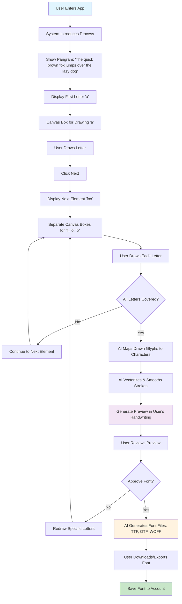

# Product Requirement Document (PRD) – v1.2

## Project Name
**HandFont – AI-Powered Handwritten Font Generator**

**Owner:** Ahsan Ali  
**Version:** 1.0
**Date:** August 2025

---

## 1. Goal

Allow users to generate custom handwritten fonts using AI, with a guided sentence-based handwriting capture system instead of photo uploads.

---

## 2. Core Value Proposition

- Anyone can create a personalized digital font in minutes.
- No scanner required — handwriting captured directly in the app.
- AI automates vectorization and font generation.
- Preview before export ensures quality.

---

## 3. Target Users

- Designers needing unique fonts
- Students and hobbyists digitizing handwriting
- Content creators for personal branding
- Businesses wanting corporate identity fonts

---

## 4. User Flow

**Detailed Steps:**
1. System introduces process (guided handwriting capture).
2. User is shown a pangram sentence: "The quick brown fox jumps over the lazy dog".
3. First element appears (e.g., letter 'a'). A canvas box below prompts the user to hand-draw 'a'.
4. User clicks 'Next'. Next element (e.g., word 'fox') appears. Beneath it, separate boxes for 'f', 'o', and 'x'. User draws each letter individually.
5. This continues until the whole sentence is covered, ensuring all letters are collected.
6. AI maps each drawn glyph to its typed reference (from pangram).
7. AI processes drawings: vectorizes strokes, aligns glyphs, and smooths curves.
8. Preview: system renders sample sentences in user's handwriting.
9. User either approves or redraws specific letters.
10. If approved, AI generates font files (TTF, OTF, WOFF).
11. User downloads/exports font or saves in account.

---

## 5. MVP Features

- Guided handwriting capture via pangram
- Canvas drawing for each letter
- AI mapping drawn glyphs → characters
- Vectorization and smoothing
- Preview renderer
- Font file export

---

## 6. Advanced Features (Future Phases)

- Custom capture sentences instead of fixed pangram
- Support for ligatures, numerals, symbols
- Handwriting style filters (calligraphy, brush, marker)
- Collaborative font creation with friends/teams
- Marketplace to sell/share fonts
- Plugins for Canva, Figma, Google Docs
- API for developers

---

## 7. Non-Goals

- OCR for handwriting recognition in full documents
- Multi-language handwriting training in MVP
- 3D pen/brush stroke simulation in MVP

---

## 8. Tech Stack

- **Frontend:** Next.js + Tailwind CSS (UI, canvas drawing, previews)
- **Backend:** Node.js + Express (APIs, font export requests)
- **Database:** PostgreSQL or MongoDB (user + font metadata)
- **AI Layer:** Python service (glyph vectorization + font creation)
- **Storage:** AWS S3 or Firebase (generated fonts)
- **Auth:** JWT / Firebase Auth
- **Payments:** Stripe, JazzCash, Easypaisa

---

## 9. Monetization

- **Freemium:** Free plan allows one font export
- **Subscription:** Pro plans for unlimited font exports
- **Marketplace:** Commission on font sales
- **API Licensing:** 3rd-party apps can generate fonts via API

---

## 10. Success Metrics

- Number of fonts generated per month
- Average approval rate after preview
- Conversion rate free → paid users
- Marketplace activity (sales, shares)

---

## 11. Roadmap

- **Phase 1:** MVP: guided pangram flow, font generation, single export
- **Phase 2:** Add ligatures, numerals, marketplace

---
